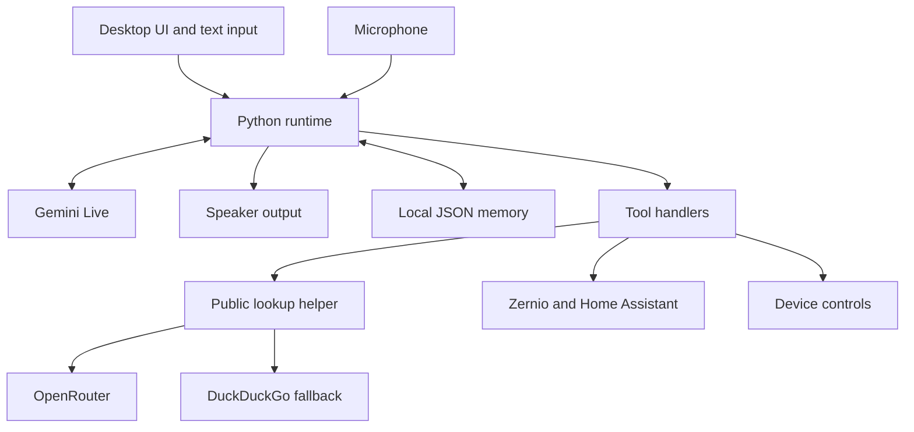

# Misa AI Core Online

**A personal voice assistant for Ubuntu/Linux, built with Python, Gemini Live and Docker.**

Misa combines spoken conversation, a full-screen desktop interface, local memory and optional tools for social analytics, device controls and Home Assistant. It is designed to run on a Linux laptop or touchscreen appliance with a microphone and speakers.

This is the **online edition**: Gemini handles voice conversation, while OpenRouter supports helper calls. Running the application in Docker does not make inference offline. Audio and relevant request context are sent to the configured providers.

[Repository](https://github.com/Vivek-Deepashree-Ravi/Misa_AI_Core_Online) · [Setup](#quick-start) · [Configuration](#configuration) · [Troubleshooting](#troubleshooting) · [Known limitations](#known-limitations)

## Features

- Real-time voice conversation through Gemini Live.
- Full-screen PyQt6 WebEngine interface with an HTML/CSS front end.
- Text input, conversation display and microphone-mode controls.
- Local JSON memory for personal facts, preferences and projects.
- OpenRouter helper client with an ordered fallback model pool.
- Optional Instagram/TikTok analytics through Zernio.
- Optional Home Assistant controls for lights and switches.
- Appliance controls for speaker volume, with additional device-specific helpers.
- Docker configuration for Linux display/audio access and persistent data.

> **Development status:** This is a working development project, not a finished autonomous agent platform. Read the limitations below, particularly the behavior of mute mode and public-information lookup.

## Architecture



The desktop interface is loaded locally by Qt WebEngine; Misa does not expose a browser chat server or a web port in this repository.

| Layer | Implementation |
| --- | --- |
| Runtime | Python 3.11, asyncio, Google Gen AI SDK |
| Voice | Gemini Live; `sounddevice`/PortAudio; PCM resampling |
| Interface | PyQt6, Qt WebEngine, Qt WebChannel, HTML/CSS |
| Helper model calls | OpenRouter chat-completions API |
| Memory | Local JSON files |
| Packaging | Docker and Docker Compose |

## Requirements

- Ubuntu/Linux desktop with X11 or a working XWayland display.
- Docker Engine and the Docker Compose plugin.
- Git and a terminal opened in the desktop session.
- PulseAudio, or PipeWire with PulseAudio compatibility.
- Working microphone and speakers.
- Internet access and a Gemini API key with access to the configured Live model.
- An OpenRouter API key for OpenRouter-backed helpers.
- Host `xhost` utility for the provided display-access launcher.

Zernio and Home Assistant credentials are optional. No local model download or dedicated inference GPU is configured by this project. Provider availability, usage limits and charges depend on your account and selected models.

## Quick start

### 1. Clone the repository

```bash
git clone https://github.com/Vivek-Deepashree-Ravi/Misa_AI_Core_Online.git
cd Misa_AI_Core_Online
```

### 2. Configure credentials

For a fresh checkout:

```bash
cp .env.example .env
chmod 600 .env
nano .env
```

If `.env` already exists, edit it rather than copying over it. Replace the credential placeholders locally. Leave unused optional credentials empty or remove their lines.

```dotenv
GEMINI_API_KEY=your-gemini-api-key
GEMINI_LIVE_MODEL=gemini-3.1-flash-live-preview
OPENROUTER_API_KEY=your-openrouter-api-key

MISA_INPUT_DEVICE=pulse
MISA_OUTPUT_DEVICE=pulse
MISA_INPUT_DEVICE_RATE=48000
MISA_OUTPUT_DEVICE_RATE=48000
```

The Live model ID above is the repository's configured default, not a guarantee of current availability. If the provider rejects it, select a Live-compatible model available to your account.

### 3. Start Misa

Run from the project root in your Linux desktop session:

```bash
bash run-docker.sh
```

The launcher checks `.env`, the display and the PulseAudio socket; sets host user/group IDs; creates persistent directories; grants the local user X11 access; and starts Compose with a build.

Misa should open as a full-screen desktop window. Press **F11** to toggle full-screen mode. Successful voice startup logs include `Connected`, `Mic stream open`, `Recv started` and `Play started`.

The Compose service is named `misa`; the container is named `misa-ai`. Its restart policy is `"no"`, so it will not automatically restart after the container exits.

## Configuration

| Variable | Purpose | Default / requirement |
| --- | --- | --- |
| `GEMINI_API_KEY` | Gemini Live authentication | Required for voice runtime |
| `GEMINI_LIVE_MODEL` | Live conversation model | `gemini-3.1-flash-live-preview` |
| `OPENROUTER_API_KEY` | Helper-model authentication | Required for OpenRouter helpers |
| `MISA_INPUT_DEVICE` | PortAudio input-device name or numeric index | `pulse` |
| `MISA_OUTPUT_DEVICE` | PortAudio output-device name or numeric index | `pulse` |
| `MISA_INPUT_DEVICE_RATE` | Input device sample rate | `48000` |
| `MISA_OUTPUT_DEVICE_RATE` | Output device sample rate | `48000` |
| `ZERNIO_API_KEY` | Connected social-account analytics | Optional |
| `HOME_ASSISTANT_URL` | Home Assistant server URL | Optional |
| `HOME_ASSISTANT_TOKEN` | Home Assistant authentication | Optional |

Audio is resampled from the input device rate to 16 kHz for sending, and from 24 kHz to the output device rate for playback.

The current voice is hardcoded to **Leda** in `misa_ai_core/runtime.py`. A `MISA_VOICE` environment variable is not implemented.

The OpenRouter text/vision pools are defined in `misa_ai_core/ai/openrouter_gateway.py`. There is no `OPENROUTER_MODELS` environment setting in this repository. The shipped IDs use `:free`, but availability and account limits still apply, and they do not make Gemini voice usage free. Optional model arguments in the client are not restricted to free models.

For credentials, `settings.py` reads legacy `config/api_keys.json`, then `.env`, then supported process-environment overrides. Docker Compose loads `.env` into the container environment; changing the host file requires recreating the container.

## Everyday commands

Run these from the project root:

```bash
# Container status
docker compose ps -a

# Recent logs
docker compose logs --tail=100 misa

# Follow logs
docker compose logs -f misa

# Restart with the current container configuration
docker compose restart misa

# Apply changes to .env or Compose configuration
docker compose up -d --force-recreate misa

# Rebuild after changing application code or dependencies
docker compose up -d --build misa

# Stop and remove the container; host data folders remain
docker compose down
```

Use the launcher for initial setup, especially when your user/audio group IDs differ from the Compose defaults. Direct Compose commands do not repeat the launcher's desktop checks.

### Listening controls

```bash
python3 assistantctl status
python3 assistantctl mute
python3 assistantctl unmute
```

These commands update the listening-state file shared with the container. The UI also has a mute toggle, but that toggle does not persist its state through the same file; CLI status may therefore differ from the UI. Startup resets listening to unmuted.

**Mute is currently a response-suppression mode, not a microphone privacy switch.** Audio continues to be sent to Gemini for wake-phrase recognition. Muted mode suppresses replies and tool execution. For a microphone privacy stop, stop Misa or disable microphone capture at the operating-system/hardware level.

## Project layout

| Path | Responsibility |
| --- | --- |
| `compose.yaml`, `Dockerfile` | Container, dependencies, audio/display access and mounts |
| `run-docker.sh` | Recommended Linux Docker launcher |
| `assistantctl` | Listening-state CLI |
| `misa_ai_core/runtime.py` | Gemini session, audio queues, tool declarations and dispatch |
| `misa_ai_core/settings.py` | Configuration and credential loading |
| `misa_ai_core/ai/openrouter_gateway.py` | OpenRouter requests and model fallback |
| `misa_ai_core/display/hud.py` | Qt window and Python/JavaScript bridge |
| `misa_ai_core/display/web/` | Interface HTML and CSS |
| `misa_ai_core/persona/system_prompt.txt` | Misa's personality and tool-use instructions |
| `misa_ai_core/memory/store.py` | Local memory storage and prompt formatting |
| `misa_ai_core/state/listening.py` | Listening-state persistence |
| `misa_ai_core/tools/` | Public lookup, social analytics, home and device controls |
| `memory/`, `config/`, `runtime/` | Persistent local data |

## Tools and memory

Gemini can request the following functions through the runtime:

| Tool | Purpose |
| --- | --- |
| `web_search` | Public-information helper; see the search limitation below |
| `social_insights` | Read connected Instagram/TikTok analytics through Zernio |
| `pi_controls` | Listening mode, speaker volume and appliance-specific controls |
| `home_control` | Home Assistant light/switch status and actions |
| `save_memory` | Save durable personal facts and preferences |
| `shutdown_misa` | Close the assistant |

There is no general desktop automation or arbitrary shell-execution tool exposed to the model. Device helpers internally run predefined commands.

Memory is stored in `memory/long_term.json`. The store limits individual values and trims older entries when its serialized content exceeds approximately 2,200 characters. It is a small personal-memory store, not a document RAG database. Memory enters the Gemini system prompt when a session connects; newly saved facts are not automatically injected into an already-open session. Automatic post-conversation OpenRouter memory extraction is disabled in the runtime; explicit `save_memory` calls remain available.

## Data and privacy

| Host directory | Container location | Contents |
| --- | --- | --- |
| `memory/` | `/app/memory` | Personal memory |
| `config/` | `/app/config` | Local integration configuration |
| `runtime/` | `/app/runtime` | PID and listening-state files |

These are bind mounts and survive container rebuilds. Stop Misa before copying them for a consistent backup. Do not commit credentials, personal memories or runtime logs.

The container uses host networking and access to X11, the audio socket and `/dev/snd`. It runs as the configured host UID/GID. Treat the checkout and its dependencies as trusted application code with desktop access, not as an isolated sandbox.

Keep `.env` private. Revoke exposed keys before replacing them. Logs can contain spoken text, tool arguments and saved facts; redact these before sharing logs publicly. Local memory storage does not prevent relevant memory from being sent to Gemini as context.

## Troubleshooting

### The window does not open

Run the launcher from the desktop session, not a headless SSH session. Check:

```bash
echo "$DISPLAY"
ls -l /tmp/.X11-unix
docker compose logs --tail=100 misa
```

Confirm that WebEngine imports inside the image:

```bash
docker compose run --rm --no-deps misa python -c \
  'from PyQt6.QtWebEngineWidgets import QWebEngineView; print("WebEngine import OK")'
```

### No microphone audio or invalid sample rate

Check host audio devices and the container's PortAudio devices:

```bash
pactl list short sources
pactl list short sinks
docker compose exec misa python -m sounddevice
```

Start with the supplied `pulse` device names and 48 kHz device rates. Ensure the PulseAudio-compatible socket exists and is mounted. After editing `.env`, recreate the container.

### OpenRouter returns HTTP 401

The key was not accepted. Changing models will not repair authentication. Verify the OpenRouter key locally, replace it if needed, and recreate the container:

```bash
docker compose up -d --force-recreate misa
```

Check credential presence without printing values:

```bash
docker compose exec misa python -c \
  'from misa_ai_core.settings import get_secret; print("Gemini configured:", bool(get_secret("GEMINI_API_KEY"))); print("OpenRouter configured:", bool(get_secret("OPENROUTER_API_KEY")))'
```

Presence does not prove validity. The current gateway retries authentication failures across its model pool, so an invalid key can cause a long delay before the final error.

### The UI opens but voice never connects

Inspect logs for the actual Gemini error. Check the key, model access and network connectivity. The UI's bridge status alone does not establish a working Gemini connection. Audio-device failures can also trigger the runtime's reconnect loop.

### Source changes do not appear

The source is copied into the image, not bind-mounted. Rebuild:

```bash
docker compose up -d --build misa
```

### Syntax check

```bash
docker compose run --rm --no-deps misa \
  python -m compileall -q /app/misa_ai_core
```

This checks Python syntax only; it does not validate model access, audio hardware, tool behavior or missing names inside unexecuted functions.

## Known limitations

The following describe the inspected code, not completed fixes:

- **Public lookup:** `web_search()` first asks an OpenRouter model without retrieving web evidence. DuckDuckGo is used only after that call fails. Do not treat a successful response as verified live research. The comparison helper is not wired into this path, and the duplicate exception handler does not catch failures raised inside the fallback handler.
- **JSON helper:** `chat_json()` references `json` without importing it, producing a `NameError` when called.
- **Credential editing:** `write_env()` rewrites a limited set of keys and can discard existing model/audio settings. Prefer manual `.env` edits until this is corrected.
- **Audio:** Mute still transmits audio for wake recognition. Microphone input is gated while Misa is speaking; seamless interruption is not guaranteed.
- **Device helpers:** Some controls contain fixed user/device identifiers. Volume helpers do not check subprocess exit status before reporting success. Brightness writes a state file that the current HUD does not consume.
- **Home control:** Fuzzy entity matching can select multiple devices. There is no general confirmation workflow; verify targets before using connected actuators.
- **Build reproducibility:** Python dependencies are unpinned. A later rebuild can install different package versions.
- **Offline operation:** No local voice/model fallback is wired into this edition.

## Agents Office integration

The separate Misa Company / Agents Office project is **not connected in this repository**. There are no task-submission, progress or proposal-retrieval tools here yet.

The intended integration is to add authenticated office tools to `misa_ai_core/tools/` and register them in `runtime.py`. With the current Linux host-network Compose configuration, Misa can reach an office published on the same host at `http://127.0.0.1:4520`. This is an integration path, not a feature already implemented.

## Development

Change personality in `persona/system_prompt.txt`, visuals in `display/web/`, and tool behavior in `tools/`. Register new tool schemas and handlers together in `runtime.py`.

Before contributing, check that no credentials or personal data are staged, run a syntax check, and describe which behavior was actually tested. Hardware and provider tests require a local desktop environment and the relevant accounts.

This README documents source reviewed at commit `9997e6d`. That review checked Python syntax and reproduced the JSON-helper error without live provider or device calls; it does not certify an end-to-end deployment.

## Attribution and licensing

Misa AI Core was adapted from [Omarvscape / Jarvis](https://github.com/amrselim95/Omarvscape---Jarvis).

No standalone `LICENSE` file was present in the inspected checkout. Review the upstream terms and establish this repository's license before redistribution; public source availability alone is not a license grant.
