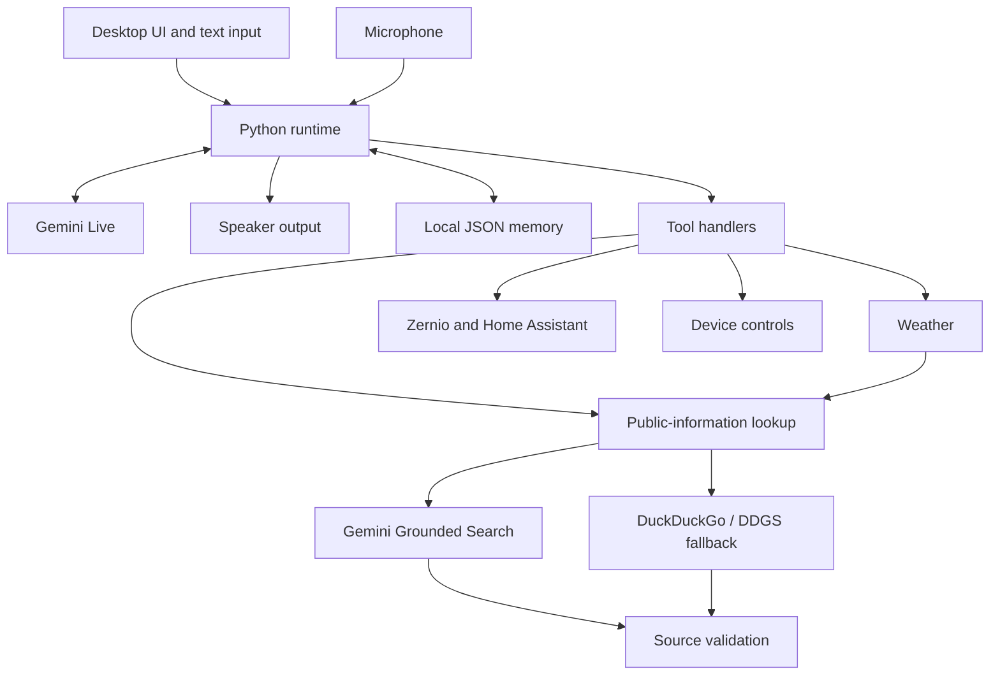

# Misa AI Core Online

**A personal voice assistant for Ubuntu/Linux, built with Python, Gemini Live and Docker.**

Misa combines spoken conversation, a full-screen desktop interface, local memory and optional tools for public-information lookup, social analytics, device controls, weather and Home Assistant.

This is the **online edition**: Gemini handles voice conversation and grounded public-information retrieval, while OpenRouter supports helper calls. Running the application in Docker does not make inference offline. Audio and relevant request context are sent to the configured providers.

**Repository:** `https://github.com/Vivek-Deepashree-Ravi/Misa_AI_Core_Online`

---

## Features

- Real-time voice conversation through Gemini Live.
- Gemini-grounded public-information lookup for current information.
- DuckDuckGo Search (`DDGS`) fallback when Gemini grounding is unavailable.
- Source-aware web-search results with validation before current-information responses are returned.
- Fresh machine date/time context, including Asia/Kolkata local time.
- Current-weather integration using live web information.
- Full-screen PyQt6 WebEngine interface with an HTML/CSS front end.
- Text input, conversation display and microphone-mode controls.
- Local JSON memory for personal facts, preferences and projects.
- OpenRouter helper client with an ordered fallback model pool.
- Optional Instagram/TikTok analytics through Zernio.
- Optional Home Assistant controls for lights and switches.
- Appliance controls for speaker volume and other device-specific helpers.
- Docker configuration for Linux display/audio access and persistent data.
- Automatic Gemini-session reconnect handling.
- Startup briefing support for current weather and headlines.

> **Development status:** This is a working development project, not a finished autonomous agent platform. Read the limitations below, particularly the behavior of mute mode, provider availability and the requirement for live web retrieval when answering time-sensitive public-information questions.

---

## Architecture


```mermaid
flowchart TD
    UI["Desktop UI and text input"] --> Runtime["Python runtime"]
    Mic["Microphone"] --> Runtime

    Runtime <--> Gemini["Gemini Live"]
    Runtime --> Speaker["Speaker output"]

    Runtime <--> Memory["Local JSON memory"]

    Runtime --> Tools["Tool handlers"]

    Tools --> Search["Public-information lookup"]
    Search --> Grounded["Gemini Grounded Search"]
    Search --> DDGS["DuckDuckGo / DDGS fallback"]
    Grounded --> Validation["Source validation"]
    DDGS --> Validation

    Tools --> Weather["Weather"]
    Weather --> Search

    Tools --> Services["Zernio and Home Assistant"]
    Tools --> Device["Device controls"]
```

The desktop interface is loaded locally by Qt WebEngine. Misa does not expose a browser chat server or a web port in this repository.

### Runtime stack

| Layer | Implementation |
| --- | --- |
| Runtime | Python 3.11, asyncio, Google Gen AI SDK |
| Voice | Gemini Live; `sounddevice`/PortAudio; PCM resampling |
| Interface | PyQt6, Qt WebEngine, Qt WebChannel, HTML/CSS |
| Current information | Gemini grounded search with DDGS fallback |
| Helper model calls | OpenRouter chat-completions API |
| Memory | Local JSON files |
| Weather | Live web lookup with configured/current location |
| Packaging | Docker and Docker Compose |

---

# Requirements

- Ubuntu/Linux desktop with X11 or a working XWayland display.
- Docker Engine and the Docker Compose plugin.
- Git and a terminal opened in the desktop session.
- PulseAudio, or PipeWire with PulseAudio compatibility.
- Working microphone and speakers.
- Internet access and a Gemini API key with access to the configured Live model.
- An OpenRouter API key for OpenRouter-backed helpers.
- Host `xhost` utility for the provided display-access launcher.

Zernio and Home Assistant credentials are optional.

No local model download or dedicated inference GPU is configured by this project.

Provider availability, usage limits and charges depend on your account and selected models.

---

# Quick start

## 1. Clone the repository

```bash
git clone https://github.com/Vivek-Deepashree-Ravi/Misa_AI_Core_Online.git
cd Misa_AI_Core_Online
```

## 2. Configure credentials

For a fresh checkout:

```bash
cp .env.example .env
chmod 600 .env
nano .env
```

If `.env` already exists, edit it rather than copying over it.

Replace the credential placeholders locally. Leave unused optional credentials empty or remove their lines.

```dotenv
GEMINI_API_KEY=your-gemini-api-key
GEMINI_LIVE_MODEL=gemini-3.1-flash-live-preview
OPENROUTER_API_KEY=your-openrouter-api-key

MISA_INPUT_DEVICE=pulse
MISA_OUTPUT_DEVICE=pulse
MISA_INPUT_DEVICE_RATE=48000
MISA_OUTPUT_DEVICE_RATE=48000
```

The Live model ID above is the repository's configured default, not a guarantee of current availability. If the provider rejects it, select a Live-compatible model available to your account.

## 3. Start Misa

Run from the project root in your Linux desktop session:

```bash
bash run-docker.sh
```

The launcher checks `.env`, the display and the PulseAudio socket; sets host user/group IDs; creates persistent directories; grants the local user X11 access; and starts Compose with a build.

Misa should open as a full-screen desktop window.

Press **F11** to toggle full-screen mode.

Successful voice startup logs include:

```text
Connected
Mic stream open
Recv started
Play started
```

The Compose service is named `misa`; the container is named `misa-ai`.

Its restart policy is `"no"`, so it will not automatically restart after the container exits.

---

# Current-information system

One of the major runtime upgrades is the public-information lookup pipeline.

Misa should not treat the language model's existing knowledge as live information.

For requests involving changing or current information, the runtime uses a dedicated search path.

## Search flow

```text
User asks for current information
            |
            v
      Gemini grounded search
            |
            v
     Validate search result
       /             \
   usable             invalid/unavailable
     |                       |
     v                       v
Return sourced answer      DDGS fallback
                              |
                              v
                       Validate results
                         /        \
                     usable       none
                       |            |
                       v            v
                Return sources   Explicit failure
```

### Primary provider: Gemini grounded search

The runtime first attempts a Gemini request using web grounding/search capability.

This allows Misa to retrieve information from the live web instead of relying only on the model's training knowledge.

The runtime also checks whether usable source information was actually returned.

A successful model response by itself is not considered sufficient evidence for a current-information request.

### Fallback: DDGS

If Gemini grounding is unavailable or does not produce usable search evidence, Misa falls back to DuckDuckGo Search through the `ddgs` Python package.

The current implementation uses:

```python
from ddgs import DDGS
```

The older `duckduckgo-search` package should not be used for the current implementation.

### Source validation

The web-search layer validates whether a provider actually returned usable source information.

This prevents a normal language-model response from being incorrectly presented as verified live research.

When search fails completely, the runtime should report the failure rather than inventing or silently presenting stale information as current.

### Important limitation

Live search improves current-information accuracy, but it does not guarantee that every web result is correct.

Search results can be unavailable, incomplete, delayed, blocked or wrong.

For high-stakes information, verify the underlying source directly.

---

# Current date and time

Misa injects fresh machine date/time context into the runtime.

The current local context is used so that Misa can correctly interpret requests such as:

- "today"
- "tomorrow"
- "tonight"
- "this morning"
- "yesterday"
- "this week"
- "current date"
- "what time is it?"

The configured runtime environment uses the local **Asia/Kolkata** clock for the current machine context.

> Current date/time context does **not** give Gemini current knowledge by itself. Time-sensitive public facts still require the web-search pipeline.

---

# Weather

Weather requests use live information rather than relying on the model's training knowledge.

The weather integration can carry the configured/current location into the weather lookup so that requests such as:

```text
What's the weather here?
```

can use the runtime's location context.

Weather results can include location metadata describing where the weather lookup was performed.

The startup briefing can also request current weather information.

Because weather changes continuously, live lookup is required for current conditions.

---

# Configuration

| Variable | Purpose | Default / requirement |
| --- | --- | --- |
| `GEMINI_API_KEY` | Gemini authentication | Required |
| `GEMINI_LIVE_MODEL` | Gemini Live conversation model | `gemini-3.1-flash-live-preview` |
| `OPENROUTER_API_KEY` | Helper-model authentication | Required for OpenRouter helpers |
| `MISA_INPUT_DEVICE` | PortAudio input-device name or numeric index | `pulse` |
| `MISA_OUTPUT_DEVICE` | PortAudio output-device name or numeric index | `pulse` |
| `MISA_INPUT_DEVICE_RATE` | Input device sample rate | `48000` |
| `MISA_OUTPUT_DEVICE_RATE` | Output device sample rate | `48000` |
| `ZERNIO_API_KEY` | Connected social-account analytics | Optional |
| `HOME_ASSISTANT_URL` | Home Assistant server URL | Optional |
| `HOME_ASSISTANT_TOKEN` | Home Assistant authentication | Optional |

Audio is resampled from the input-device rate to 16 kHz for sending, and from 24 kHz to the output-device rate for playback.

The current voice is hardcoded to **Leda** in `misa_ai_core/runtime.py`.

A `MISA_VOICE` environment variable is not currently implemented.

### OpenRouter

The OpenRouter text/vision pools are defined in:

```text
misa_ai_core/ai/openrouter_gateway.py
```

There is no `OPENROUTER_MODELS` environment setting in this repository.

The shipped model IDs use `:free`, but availability and account limits still apply.

Free OpenRouter models do **not** make Gemini Live voice usage free.

Optional model arguments in the client are not restricted to free models.

### Credentials

`settings.py` reads credentials from the supported configuration sources, including:

1. Legacy `config/api_keys.json`
2. `.env`
3. Supported process-environment overrides

Docker Compose loads `.env` into the container environment.

Changing the host `.env` file requires recreating the container for the new environment to be applied.

---

# Everyday commands

Run these from the project root:

```bash
# Container status
docker compose ps -a

# Recent logs
docker compose logs --tail=100 misa

# Follow logs
docker compose logs -f misa

# Restart with the current container configuration
docker compose restart misa

# Apply changes to .env or Compose configuration
docker compose up -d --force-recreate misa

# Rebuild after changing application code or dependencies
docker compose up -d --build misa

# Stop and remove the container; host data folders remain
docker compose down
```

Use the launcher for initial setup, especially when your user/audio group IDs differ from the Compose defaults.

Direct Compose commands do not repeat the launcher's desktop checks.

---

# Listening controls

```bash
python3 assistantctl status
python3 assistantctl mute
python3 assistantctl unmute
```

These commands update the listening-state file shared with the container.

The UI also has a mute toggle, but that toggle does not persist its state through the same file; CLI status may therefore differ from the UI.

Startup resets listening to unmuted.

> **Mute is currently a response-suppression mode, not a microphone privacy switch.**

Audio continues to be sent to Gemini for wake-phrase recognition.

Muted mode suppresses replies and tool execution.

For a microphone privacy stop, stop Misa or disable microphone capture at the operating-system/hardware level.

---

# Project layout

| Path | Responsibility |
| --- | --- |
| `compose.yaml`, `Dockerfile` | Container, dependencies, audio/display access and mounts |
| `run-docker.sh` | Recommended Linux Docker launcher |
| `assistantctl` | Listening-state CLI |
| `misa_ai_core/runtime.py` | Gemini session, audio queues, current context, tool declarations and dispatch |
| `misa_ai_core/settings.py` | Configuration and credential loading |
| `misa_ai_core/ai/openrouter_gateway.py` | OpenRouter requests and model fallback |
| `misa_ai_core/display/hud.py` | Qt window and Python/JavaScript bridge |
| `misa_ai_core/display/web/` | Interface HTML and CSS |
| `misa_ai_core/persona/system_prompt.txt` | Misa's personality and tool-use instructions |
| `misa_ai_core/memory/store.py` | Local memory storage and prompt formatting |
| `misa_ai_core/state/listening.py` | Listening-state persistence |
| `misa_ai_core/tools/` | Public lookup, weather, social analytics, Home Assistant and device controls |
| `memory/`, `config/`, `runtime/` | Persistent local data |

---

# Tools and memory

Gemini can request functions through the runtime.

| Tool | Purpose |
| --- | --- |
| `web_search` | Current public-information lookup using Gemini grounding and DDGS fallback |
| `social_insights` | Read connected Instagram/TikTok analytics through Zernio |
| `pi_controls` | Listening mode, speaker volume and appliance-specific controls |
| `home_control` | Home Assistant light/switch status and actions |
| `save_memory` | Save durable personal facts and preferences |
| `shutdown_misa` | Close the assistant |

There is no general desktop automation or arbitrary shell-execution tool exposed to the model.

Device helpers internally run predefined commands.

## Memory

Memory is stored in:

```text
memory/long_term.json
```

The store limits individual values and trims older entries when its serialized content exceeds approximately 2,200 characters.

It is a small personal-memory store, not a document RAG database.

Memory enters the Gemini system prompt when a session connects.

Newly saved facts are not automatically injected into an already-open session.

Automatic post-conversation OpenRouter memory extraction is disabled in the runtime.

Explicit `save_memory` calls remain available.

---

# Data and privacy

| Host directory | Container location | Contents |
| --- | --- | --- |
| `memory/` | `/app/memory` | Personal memory |
| `config/` | `/app/config` | Local integration configuration |
| `runtime/` | `/app/runtime` | PID and listening-state files |

These are bind mounts and survive container rebuilds.

Stop Misa before copying them for a consistent backup.

Do not commit credentials, personal memories or runtime logs.

The container uses host networking and access to:

- X11
- the audio socket
- `/dev/snd`

It runs as the configured host UID/GID.

Treat the checkout and its dependencies as trusted application code with desktop access, not as an isolated sandbox.

Keep `.env` private.

Revoke exposed keys before replacing them.

Logs can contain spoken text, tool arguments and saved facts. Redact these before sharing logs publicly.

Local memory storage does not prevent relevant memory from being sent to Gemini as context.

---

# Troubleshooting

## The window does not open

Run the launcher from the desktop session, not a headless SSH session.

Check:

```bash
echo "$DISPLAY"
ls -l /tmp/.X11-unix
docker compose logs --tail=100 misa
```

Confirm that WebEngine imports inside the image:

```bash
docker compose run --rm --no-deps misa python -c \
    'from PyQt6.QtWebEngineWidgets import QWebEngineView; print("WebEngine import OK")'
```

---

## No microphone audio or invalid sample rate

Check host audio devices and the container's PortAudio devices:

```bash
pactl list short sources
pactl list short sinks
docker compose exec misa python -m sounddevice
```

Start with the supplied `pulse` device names and 48 kHz device rates.

Ensure the PulseAudio-compatible socket exists and is mounted.

After editing `.env`, recreate the container:

```bash
docker compose up -d --force-recreate misa
```

---

## OpenRouter returns HTTP 401

The key was not accepted.

Changing models will not repair authentication.

Verify the OpenRouter key locally, replace it if needed, and recreate the container:

```bash
docker compose up -d --force-recreate misa
```

Check credential presence without printing values:

```bash
docker compose exec misa python -c \
    'from misa_ai_core.settings import get_secret; print("Gemini configured:", bool(get_secret("GEMINI_API_KEY"))); print("OpenRouter configured:", bool(get_secret("OPENROUTER_API_KEY")))'
```

Presence does not prove validity.

The current gateway retries authentication failures across its model pool, so an invalid key can cause a delay before the final error.

---

## Current-information lookup fails

Inspect the logs for the web-search pipeline.

Typical log entries identify the search stage/provider.

The current search flow is:

```text
Gemini grounded search
        ↓
source validation
        ↓
DDGS fallback if necessary
        ↓
validated result or explicit failure
```

If DDGS is unavailable after a dependency update, verify that the current package is installed:

```bash
docker compose exec misa python -c \
    'from ddgs import DDGS; print("DDGS import OK")'
```

If the dependency changed, rebuild the image:

```bash
docker compose up -d --build misa
```

Do not install or restore the old `duckduckgo-search` import path for the current runtime.

---

## Weather uses the wrong location

Inspect the weather and startup logs.

The runtime now provides location context to the weather flow.

If the configured weather location is changed, rebuild/recreate the container as appropriate so the current configuration is loaded.

Weather still depends on live web retrieval and provider availability.

---

## The UI opens but voice never connects

Inspect logs for the actual Gemini error.

Check:

- API key
- Live model access
- network connectivity
- microphone availability
- output-device availability
- configured sample rates

The UI's bridge status alone does not establish a working Gemini connection.

Audio-device failures can also trigger the runtime's reconnect loop.

---

## Source changes do not appear

The source is copied into the image, not bind-mounted.

Rebuild:

```bash
docker compose up -d --build misa
```

For dependency changes, a clean rebuild may be required:

```bash
docker compose build --no-cache misa
docker compose up -d misa
```

---

## Syntax check

```bash
docker compose run --rm --no-deps misa \
    python -m compileall -q /app/misa_ai_core
```

This checks Python syntax only.

It does not validate:

- model access
- web-search availability
- audio hardware
- tool behavior
- provider credentials
- missing names inside unexecuted functions

---

# Current known limitations

The following are limitations of the current development implementation:

### Public-information lookup

The current system uses Gemini grounded search first and DDGS as a fallback.

This is substantially different from the previous implementation, where an OpenRouter model could answer without retrieving web evidence.

However, live search is still dependent on provider availability and returned source quality.

A successful language-model response should not automatically be treated as verified research unless usable search evidence was returned.

<<<<<<< HEAD

=======
### Search fallback

DDGS is a fallback provider rather than a guarantee of availability.

Search engines can block requests, return incomplete results or fail temporarily.

Misa reports explicit lookup failure when the available providers cannot produce usable results.

### Current date context

Misa receives fresh machine date/time information.

This prevents basic date confusion, but current date context alone does not provide current news, prices, weather or other changing facts.

Those requests still require the web-search pipeline or a specialized live tool.

### Weather

Weather is live-data dependent.

If web retrieval fails, Misa cannot guarantee current weather conditions.

### JSON helper

If `chat_json()` remains part of the current OpenRouter helper implementation without the required `json` import, it must be corrected before that function can be considered reliable.

### Credential editing

`write_env()` rewrites a limited set of keys and can discard existing model/audio settings.

Prefer manual `.env` edits until this behavior is corrected.

### Audio

Mute still transmits audio for wake recognition.

Microphone input is gated while Misa is speaking.

Seamless interruption is not guaranteed.

### Device helpers

Some controls contain fixed user/device identifiers.

Volume helpers do not necessarily check subprocess exit status before reporting success.

Brightness writes a state file that the current HUD does not consume.

### Home Assistant

Fuzzy entity matching can select multiple devices.

There is no general confirmation workflow.

Verify actuator targets before using connected Home Assistant controls.

### Build reproducibility

Python dependencies are not fully pinned.

A later rebuild can install different package versions.

### Offline operation

No local voice/model fallback is wired into this edition.

Misa requires its configured online providers for Gemini Live and live-information functionality.

---

# Agents Office integration

The separate Misa Company / Agents Office project is **not connected in this repository**.

There are no task-submission, progress or proposal-retrieval tools here yet.

The intended integration is to add authenticated office tools to:

```text
misa_ai_core/tools/
```

and register them in:

```text
runtime.py
```

With the current Linux host-network Compose configuration, Misa can reach an office published on the same host at:

```text
http://127.0.0.1:4520
```

This is an integration path, not a feature already implemented.

---

# Development

Change personality in:

```text
misa_ai_core/persona/system_prompt.txt
```

Change visuals in:

```text
misa_ai_core/display/web/
```

Change tool behavior in:

```text
misa_ai_core/tools/
```

Register new tool schemas and handlers together in:

```text
misa_ai_core/runtime.py
```

## Before contributing

Check that:

- no credentials are staged
- no personal memory is staged
- Python syntax passes
- provider behavior is tested where possible
- hardware-dependent behavior is tested on the target Linux environment
- changes to current-information lookup include actual source-validation behavior
- dependency changes are reflected in the Docker build configuration

Hardware and provider tests require a local desktop environment and the relevant accounts.

---

# Upgrade notes

The current runtime has moved the public-information system away from the previous ungrounded helper behavior.

### Previous flow

```text
User
  ↓
OpenRouter model
  ↓
Model-generated answer
```

This could produce an answer that looked current without actually retrieving current web information.

### Current flow

```text
User
  ↓
Misa runtime
  ↓
Gemini grounded search
  ↓
Validate usable sources
  ↓
DDGS fallback when required
  ↓
Return sourced result
```

This makes the runtime substantially better suited to requests such as:

- current news
- today's headlines
- current weather
- recent events
- current public information
- changing facts that require web retrieval

The system should still clearly distinguish between:

**model knowledge**, **fresh date/time context**, and **retrieved live information**.

---

# Attribution and licensing

Misa AI Core was adapted from:

**Omarvscape / Jarvis**

`https://github.com/amrselim95/Omarvscape---Jarvis`

No standalone `LICENSE` file was present in the inspected checkout.

Review the upstream terms and establish this repository's license before redistribution.

Public source availability alone is not a license grant.

---

# Project status

Misa AI Core Online is an actively evolving personal voice-assistant project.

The current architecture combines:

- **Gemini Live** for voice conversation
- **Gemini grounded search** for current public information
- **DDGS** as a search fallback
- **OpenRouter** for helper-model workloads
- **Local JSON memory**
- **Live weather/current-context handling**
- **PyQt6 WebEngine** for the desktop interface
- **Docker** for deployment
- **Optional Zernio, Home Assistant and device integrations**

The system is designed to be practical and extensible while remaining transparent about where information comes from and where online-provider dependencies still exist.
>>>>>>> 8a97a49 (ddgs fallback and live loaction update to misa)
